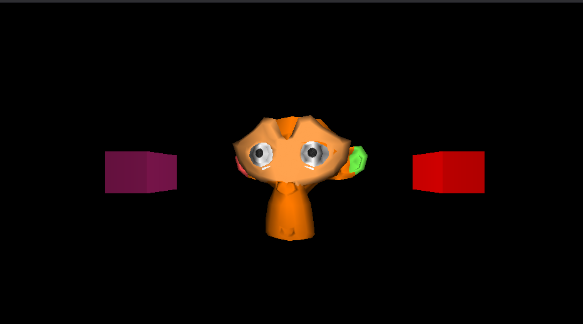

# lite-raster

**lite-raster** is a lightweight rasterization project designed for efficient 3D rendering tasks. It provides a simple way to define scenes and render raster images, making it ideal for graphics projects, educational purposes, or experimentation. This project was created as an educational challenge to better understand the fundamentals of computer graphics.

## Features

- Fast and minimal rasterization core
- Support for custom models
- Simple transformation and colour handling
- Texture mapping for custom models
- Phong lighting system

## Building

### Prerequisites

- C++17 compatible compiler (e.g., GCC, Clang, MSVC)
- CMake 3.10 or higher

### Build Instructions

```bash
git clone https://github.com/sjohnson03/lite-raster.git
cd lite-raster
mkdir build
cd build
cmake ..
cmake --build .
```

This will generate the executable binaries in the `bin/` directory.

## Usage

To use **lite-raster**, define your scene in a `.yaml` file (see [scene.yaml](examples/scene.yaml) for examples). All objects and textures must be referenced by their full path from the root.

Literaster can then be run with the scene passed as an argument.

```bash
./bin/lite-raster examples/scene.yaml
```

Example should then display:



## License

This project is licensed under the MIT License. See [LICENSE](LICENSE) for details.
